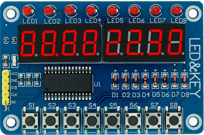

# pico-tm1638

## Pico TM1638 LED & KEY Board Driver

A lightweight C library for interfacing with the popular **TM1638 "LED & KEY"**
display and input module. This board features an 8-digit 7-segment display, 8
individual LEDs, and 8 tactile push buttons, all controlled via a 3-wire serial
interface.

## Features

* **8-Digit 7-Segment Display:** Individual control over digits and decimal points.
* **8 Status LEDs:** Independent control of the top-row red LEDs.
* **8 Tactile Buttons:** Matrix scanning for button presses via 4 read commands.
* **Brightness Adjustment:** 8 levels of (PWM) brightness (not implemented)
* **Low Pin Count:** Uses only 3 GPIO pins (`STB`, `CLK`, `DIO`).

### Pinout Configuration

| Pin Name | Type | Description | Pico Connection (Standard 5V VCC) |
| :--- | :--- | :--- | :--- |
| **VCC** | Power | 5V Power Supply | **VBUS** (Pin 40) |
| **GND** | Ground | System Ground | **GND** (Pin 28) |
| **STB** | Input | Strobe / Chip Select (Active Low) | **GPIO 21** (Pin 27) |
| **CLK** | Input | Serial Clock | **GPIO 20** (Pin 26) |
| **DIO** | Bi-directional | Data Input / Output | **GPIO 19** (Pin 25) |

**Note on 5V Operation:** The TM1638 is natively a 5V device. DIO line will push 5V
back during key-scan reads. Use 1kOhm series resistor or level shifter to avoid
damaging to the Pico's 3.3V tolerant GPIOs. Use at your own risk.

### Example code

The example code in `main.c` reads input buttons and lights segments in digit
0 corresponding to which key is pressed.
